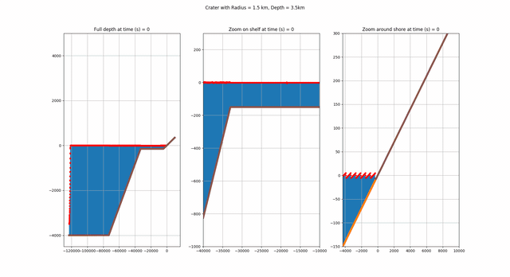

# OpenFoamUtils
This collection of tools is intended for extracting position and field data from the interface of a 
2-phase flow simulation conducted with OpenFOAM's interFoam solver in serial or parallel (i.e. decomposed) settings. 
It has been tested on Ubuntu 18.04.2 LTS (Bionic Beaver), but should work on any linux system meeting the 
dependency requirements. Users can analyze grid convergence, collapse radially symmetric 3D runs to 2D and also
apply smoothing operations to radially scaterred data using the available json interfaces.

The movie below depicts a full 3D flooding simulation given a rectilinear domain and initial interfacial impact cavity
in the bottom left corner (1.5 km radius, 3.5 km max sea depth). There is a symmetry plane boundary condition applied at the front and left walls of the grid,
so the visualized results are actually smoothed, radially scattered evolutions of the air-water interface. All post processing
was effectuated with ExtractAtInterface, which leverages utilities from the VTK API for contouring fields on unstructured grids.

