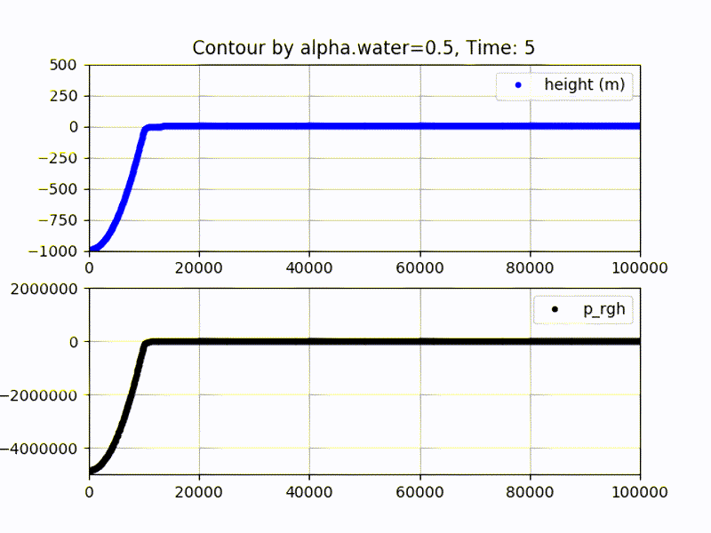

VOF Extract Field at Interface
------------------------------
This tool is intdended for extracting position and field data from 
the interface of a 2-phase flow simulation conducted with OpenFOAM's
interFoam solver in serial or parallel (i.e. decomposed) settings.
It has been tested on Ubuntu 18.04.2 LTS (Bionic Beaver), but should
work on any linux system meeting the dependency requirements.

## Build Instructions ##
### Build Dependencies ###
You will need to install at least the following dependencies:

* build-essential
* cmake
* VTK (versions 7+)
* python + matplotlib (version 2.7)
* MPI (if using it with decomposed cases)
* mencoder

### Build ExtractInterface ###
Once the dependencies are installed, execute the following from the top 
of the source tree:
```
$ mkdir build && cd build
$ cmake -DENABLE_MPI=True .. 
$ make -j6 (replace 6 with number of cores you want to use)
```
This will create the executable `ExtractAtInterface`. You can either copy it
to where it will be used, or add its absolute path to your PATH env variable. 
Also, note that the `ENABLE_MPI` compiler flag was set to true in the above
example. This is suitable when working with decomposed cases. If the 
OpenFOAM utility `reconstructPar` has been run, set `-DENABLE_MPI=False`. 

If cmake has problems finding libraries, try manually specifying paths
to cmake via the curses-gui interface. This is done by calling 
```
$ ccmake .
```
from the `build` directory, and navigating through the options. Additional
compiler flags can also be set through this interface or the command line.

## Example Usage ##
Copy the executable `ExtractAtInterface` and the script `animate.sh` 
to your OpenFOAM case directory. In this example, the directory contains decomposed 
outputs from a parallel (6 cores) run of interFoam, i.e. `reconstructPar` has **not** been called. 
The time directories are located in `processor0`,`processor1`, ..., `processor5`. 
We execute something like the following:
```
$ touch case.foam
$ mpirun -np 6 ./ExtractAtInterface case.foam <start> <stride> <end> <interface_field> <contour_val> <data_on_contour>
$ bash animate.sh
```
The output will be an avi file `output.avi`, whose name can be changed by editing
line 12 in `animate.sh` before executing the script. For a concrete example, consider
```
$ mpirun -np 6 ./ExtractAtInterface case.foam 5 5 400 alpha.water 0.5 p_rgh
```
In this case, there were 80 time (including 0) directories in each `processor` folder, 
and they were written every 5 seconds for a total of 400 s simulation time. Each frame 
of the avi file is a plot of the y coordinate of the interface, defined as alpha.water=0.5, 
and another plot of p_rgh at the interface, starting at t = 5s. 


Running it on a reconstructed case is identical, only we omit the call to `mpirun`:
```
$ ./ExtractAtInterface case.foam 5 5 400 alpha.water 0.5 p_rgh
```
See below for a sample movie: 


